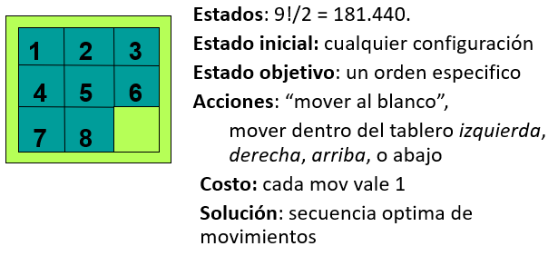
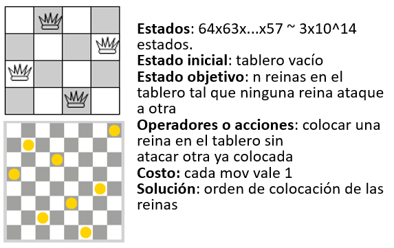

# Guia trabajo de implementacion: Métodos de busqueda

# Comparación del desempeño de diferentes métodos de búsqueda 

## I. Comparacion metodos de búsqueda basados en árboles.

1. Implementar los siguientes métodos de búsqueda para resolver el problema del **8-puzzle**:

- Primero en anchura(BFS)
- Primero en profundidad(DFS)
- Primero el mejor
- A-asterisco(A*)

2. A cada grupo de trabajo se la asignará un tablero inicial, a partir del cual deberá encontrar la solución. **Sin embargo, las implementaciones deben permitir el ingreso de la configuración inicial de un tablero a partir de un archivo de texto con el mismo formato que el respectivo archivo asignado a cada grupo**. Las implementaciones deben respetar el siguiente orden de acciones: **blanco arriba, derecha, abajo, izquierda.**

3. Las implementaciones deben mostrar al final el **tiempo computacional**, el **uso de memoria** (máximo tamaño de la cola o pila alcanzado, y número de nodos expandidos para encontrar la solución), el **camino solución** encontrado y el **número de pasos** que conforman este camino solución. 

4. Elabore un informe en el que debe incluir una descripción del esquema de representación utilizado en las **implementaciones**, las **funciones objetivo** tanto del primero el mejor, como el A-asterisco, y una **comparación** de los 4 métodos en términos de tiempo y uso de memoria, y optimalidad. 

## II. Comparación de métodos de búsqueda bioinspirados:

1.  Implemente los siguientes métodos de búsqueda bioinspirados para resolver el problema de las **N reinas**: 

- Enfriamiento simulado(SA)
- Algoritmos genéticos(GA)
- Colonias de hormigas(ACO)

2. A cada grupo se le asignarán dos tableros con N reinas y sus ocupaciones iniciales para `N= 8, 12`. Utilice sus implementaciones para resolver las configuraciones de tableros dadas. Las implementaciones **deberán recibir como entrada la representación de un tablero con una configuración inicial de reinas contenidos en un archivo de texto**, tal como se puede observar con el formato del archivo asignado. 

3. Cada implementación deberá mostrar como salida: el **tiempo empleado** para encontrar la solución, el **número de iteraciones** en que encontró la solución de los tableros asignados, una **gráfica de convergencia**. 

4. Escriba un informe que contenga lo siguiente: 
    1. Una descripción del **esquema de representación** utilizado para el problema, la **estrategia** para generar nuevas posibles soluciones, y la **función objetivo**, para cada implementación. 

    2. Por medio de gráficas y tablas resuma los **resultados obtenidos**, y los **cambios de parámetros** que deba realizar para llevar los procedimientos a una convergencia. Primero, **muestre los resultados y análisis** para el tablero `N=8`, junto con los **mejores parámetros** encontrados para resolver este problema. Segundo, de manera resumida muestre los cambios de parámetros que tuvo que realizar para poder resolver el tablero `N=12`, y la mejor solución encontrada para este caso. Los parámetros para manipular para cada algoritmo son:
    
        | Métodos | Parámetros |
        | ---- | ---- |
        | Enfriamiento simulado | Temperatura inicial, temperatura final, tasa de enfriamiento |
        | Algoritmos genéticos | Número de iteraciones, tasa de cruzamiento, tasa de mutación, tamaño de la población, tamaño de elite |
        | Colonia de hormigas | Tamaño de la colonia, número de generaciones, Alpha, y Beta |

    3. El informe debe incluir una **comparación** de los métodos entre sí en términos del tiempo promedio requerido, el **número de iteraciones** para converger, y la **solución encontrada**. 